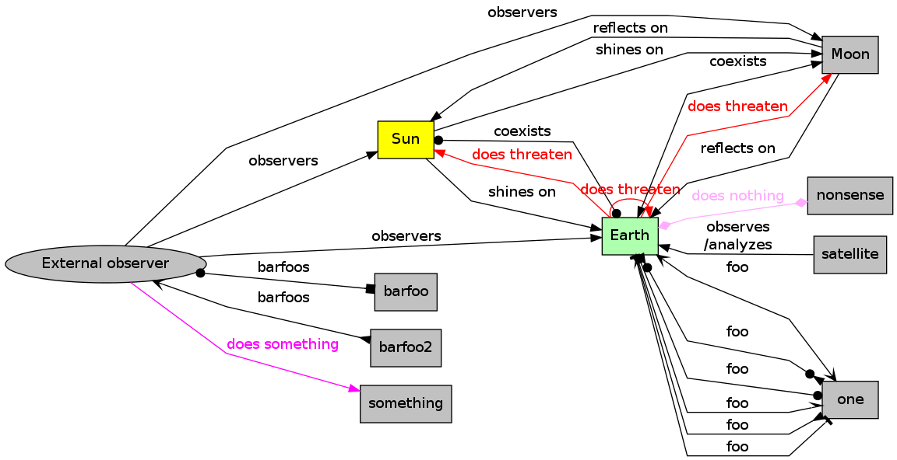

# EasyGraph

EasyGraph lets you define `graphviz` graphs using nested Python data
structures.

## Usage

*1.* Define a graph as a simple Python data structure (using variables
     etc.):

        sun = 'Sun'
        moon = 'Moon'
        earth = 'Earth'
        observer = 'External observer'
        threat_edge_style = {
            'color': '#FF0000',
            'fontcolor': '#FF0000',
            'label': 'does threaten',
            }
        graph = {
            sun: [
                ['->', earth, 'shines on'],
                ['->', moon, 'shines on'],
                {
                    'style': 'filled',
                    'fillcolor': '#FFFF00',
                    }],
            moon: [
                ['->', earth, 'reflects on'],
                ['->', sun, 'reflects on'],
                {
                    'style': 'filled',
                    'fillcolor': '#C1C1C1',
                    }],
            earth: [
                ['->', sun, 'coexists', {
                        'arrowhead': 'dot',
                        'arrowtail': 'dot',
                        'dir': 'both',
                        }],
                ['->', moon, 'coexists', {'dir': 'both'}],
                ['->', earth, 'threatens', threat_edge_style],
                ['->', sun, 'threatens', threat_edge_style],
                ['->', moon, 'threatens', threat_edge_style],
                ['->', 'satellite', 'observes\\n/analyzes', {'dir': 'back'}],
                ['o-o', 'one', 'foo'],
                ['/-\\', 'one', 'foo'],
                ['>>-<<', 'one', 'foo'],
                ['|-|', 'one', 'foo'],
                ['<<>>', 'one', 'foo'],
                ['>o-o<', 'one', 'foo'],
                ['<>-<>', 'nonsense', 'does nothing', {
                        'style': 'filled',
                        'color': '#FFAEFF',
                        'fontcolor': '#FFAEFF',
                        }],
                {
                    'style': 'filled',
                    'fillcolor': '#AEFFAE',
                    }],
            observer: [
                ['o-[]', 'barfoo', 'barfoos'],
                ['<<-<<', 'barfoo2', 'barfoos'],
                ['->', sun, 'observers'],
                ['->', moon, 'observers'],
                ['->', earth, 'observers'],
                ['->', 'something', 'does something', {
                        'fontcolor': '#FF00FF',
                        'color': '#FF00FF',
                        }],
                {
                    'shape': 'ellipse',
                    },
                ],
            }

*2.* Define the graph type:

        styles = {
          'splines': 'polyline',
          'rankdir': 'LR',
        }

*3.* Render the graph:

        graph = EasyGraph(graph, styles)
        graph.draw()

Output:
  

## Advantages
- You do not have to remember or look up the sometimes bulky `graphviz`
  syntax.
- You can easily manipulate graphs since you are dealing with pure Python
  data structures (insert a large number of nodes/args, conditionally
  choose edge types, use a pre-defined list of colors as color scheme...).
- You can use proper variables as labels.
- You can do with your graph whatever you can do with Python (do real math,
  copy and modify graphs, produces multiple graphs with slight variations,
  schedule graph generation, etc.).
